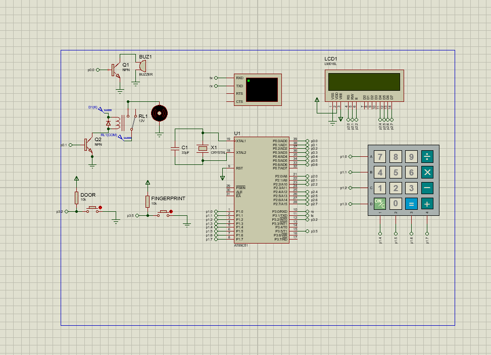

# Keil Simulathon Project

This project is a 8051-based system developed using Keil μVision. It includes drivers for:
- GSM Module (`gsm.c/h`)
- Keypad (`keypad.c/h`)
- LCD Display (`lcd.c/h`)
- Main logic in `main.c`

## Circuit Connections (Proteus)

The system is built around the **AT89C51** microcontroller. Below are the pin assignments:

### 1. LCD Display (16x2)
| Pin | Connection |
| :--- | :--- |
| RS | P2.0 |
| RW | P2.1 |
| E | P2.2 |
| D4-D7 | P2.4 - P2.7 (4-bit mode) |

### 2. 4x4 Keypad
| Pin | Connection |
| :--- | :--- |
| Rows (A-D) | P1.0 - P1.3 |
| Columns (1-4) | P1.4 - P1.7 |

### 3. Peripherals
| Peripheral | Pin | Description |
| :--- | :--- | :--- |
| Buzzer | P0.0 | Connected via NPN Transistor (Q1) |
| Relay / Motor | P0.1 | Connected via NPN Transistor (Q2) |
| Door Switch | P3.2 | External Interrupt 0 |
| Fingerprint | P3.5 | Input Sensor |
| Virtual Terminal | P3.0 (RX), P3.1 (TX) | Serial Communication |

### 4. System
| Component | Connection |
| :--- | :--- |
| Crystal | 11.0592 MHz / 12 MHz (Pins 18, 19 with 33pF Caps) |
| Reset | Pin 9 |

## Setup
1. Open the project in Keil μVision.
2. Build the project to generate the hex file.
3. Flash the hex file to the target microcontroller.
